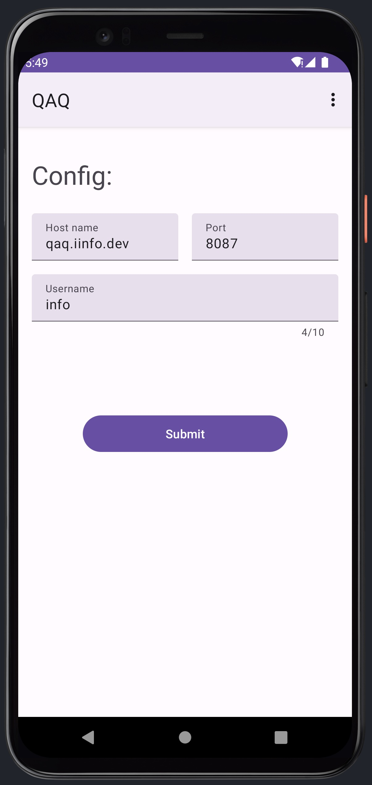
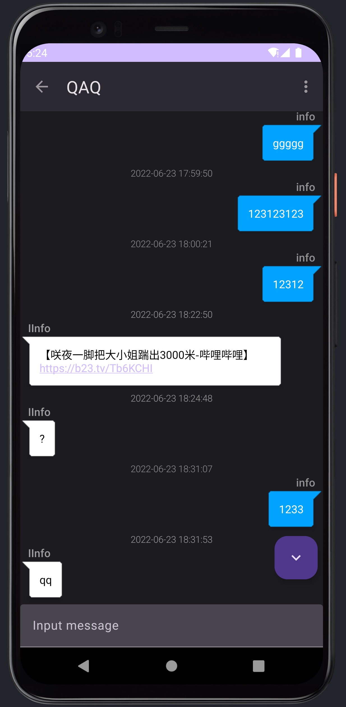

# QAQ 4 Android
> QAQ: Private TCP IM communication project

QAQ Protocol Android Implementation

     

## Screenshots

## Other QAQ Project
[QAQ-Desktop-Qt](https://github.com/I-Info/QAQ-Desktop-Qt):
QAQ Desktop application, based on Qt

[QAQ-Server](https://github.com/lixiao189/QAQServer):
QAQ Server, written in Go